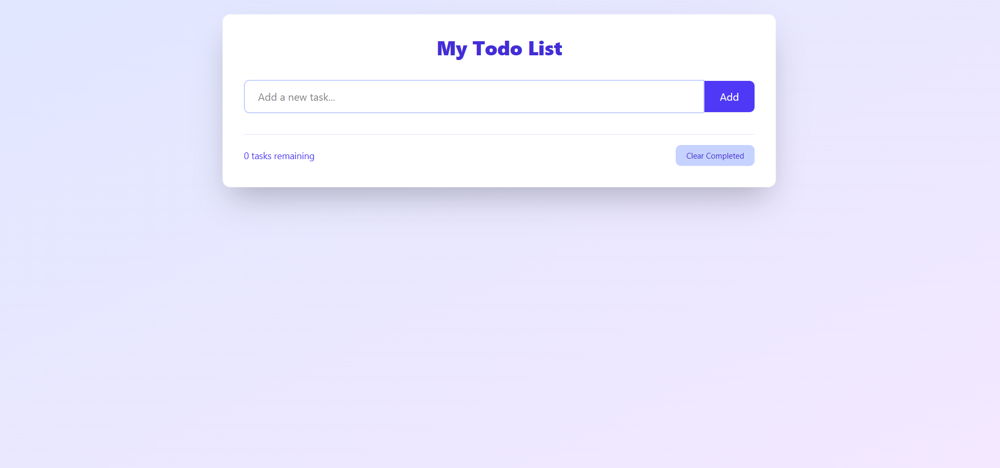
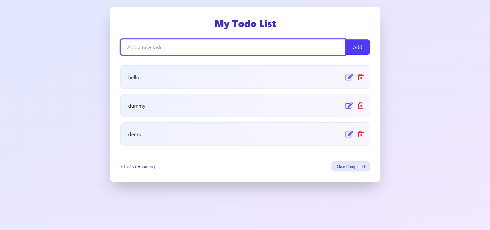
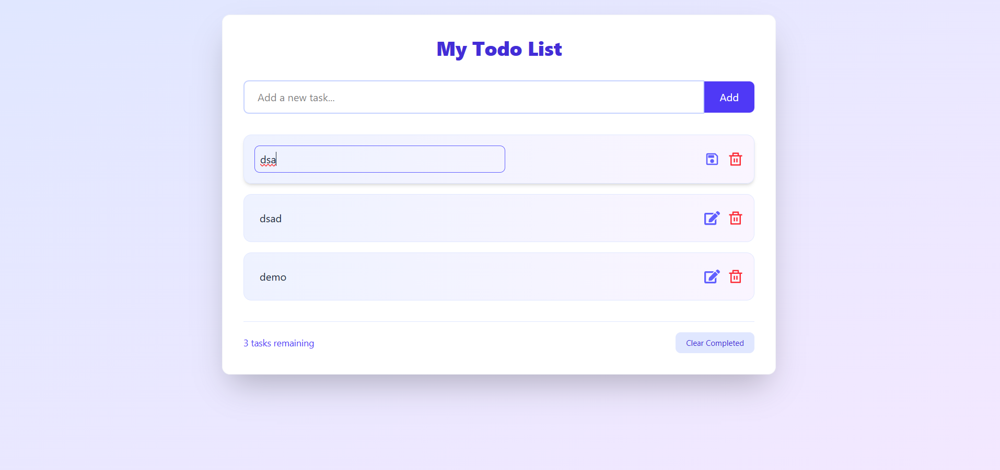

**TodoRedux - Todo Application**

This project is a Todo application built using React and Redux. It allows users to manage their tasks efficiently.

**Features**

- **Add, Edit, and Delete Todos**: Users can manage their tasks easily.
- **Persist Todos**: Todos are saved in local storage for persistence.
- **Filter and Search**: Users can filter and search through their tasks.

**Installation**

1. **Clone the repository**:
   ```bash
   git clone https://github.com/Ahmedkhan-dev99/TodoRedux
   cd TodoRedux
   ```

2. **Install dependencies**:
   ```bash
   npm install
   ```

3. **Run the application**:
   ```bash
   npm run dev
   ```


**Screenshots**

1. **Add Todo**
   

2. **Todo List**
   

3. **Edsit Todo**
   


**Usage**

Use the application to manage your tasks. You can add new todos, edit existing ones, and delete tasks as needed.

**License**

This project is licensed under the MIT License.
